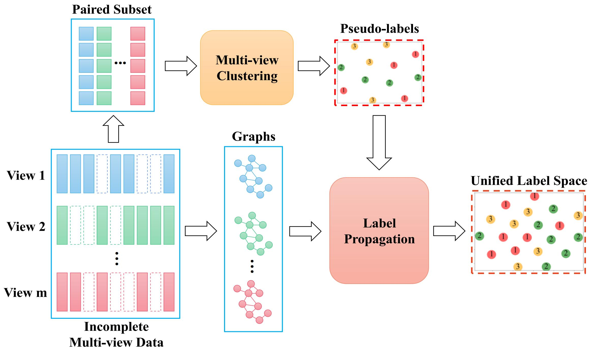
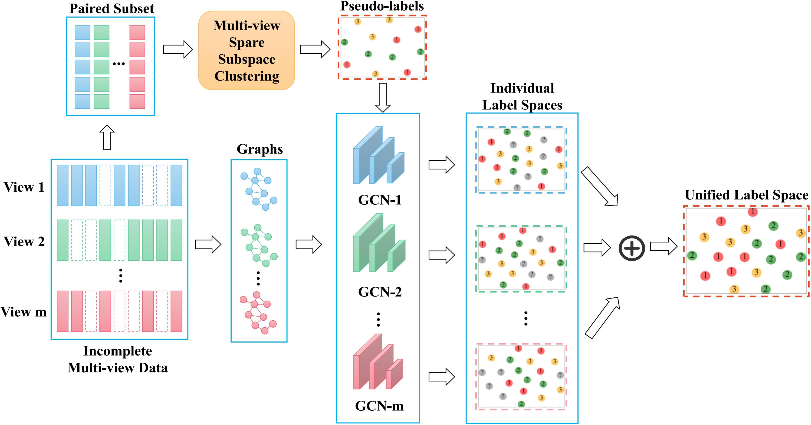
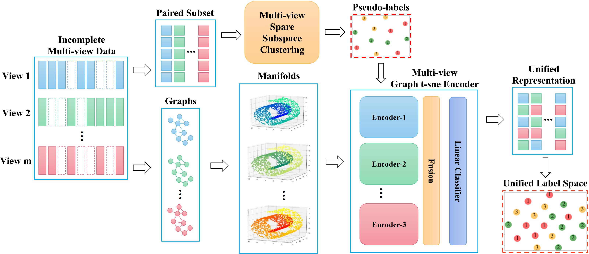

# PLP-L

The demo code for the "Deep Incomplete Multiview Clustering via Local and Global Pseudo-Label Propagation".

## Abstract

In recent years, incomplete multi-view clustering has attracted many researchers' interest as an important and challenging problem. This paper proposes a novel framework based on pseudo-label propagation to address this problem, inspired by the label propagation technique in graph-based semi-supervised learning. Our framework utilizes pseudo-labels generated from the paired subset of data and effectively propagates them to the unpaired samples. Specifically, we present a simple yet effective local propagation model, which integrates within-view propagation and label fusion to learn a unified label space. Furthermore, we propose a global propagation model that integrates the multi-view graph t-sne encoder to enhance the clustering robustness and accuracy. The model effectively reduces the noise interference of pseudo-labels by utilizing graph and manifold information. Our extensive experiments demonstrate the efficacy of our local and global models. The local model provides a robust baseline, while the global model outperforms existing methods in handling the challenging task of clustering multi-view data with missing values.

## General PLP Framework

The general framework of the pseudo-label propagation consists of two steps: learning pseudo-labels from the paired subset of the incomplete multi-view data, and training a label propagation model to assign the pseudo-labels to all the samples.

## Local Propagation Model (PLP-L)

Our local propagation model. The circles with different colors and numbers represent the samples with labels, whereas the gray circles with a question mark denote the unlabeled samples. The ``plus" mark represents the label fusion step, where the class probabilities of individual label spaces are averaged.

## Global Propagation Model (PLP-G)

Our global propagation model. Instead of learning individual label spaces, the graphs, manifolds, and features of all samples and views are holistically fed into the global model. After convergence, we use $k$-means to cluster the unified representation and get the unified label space.
